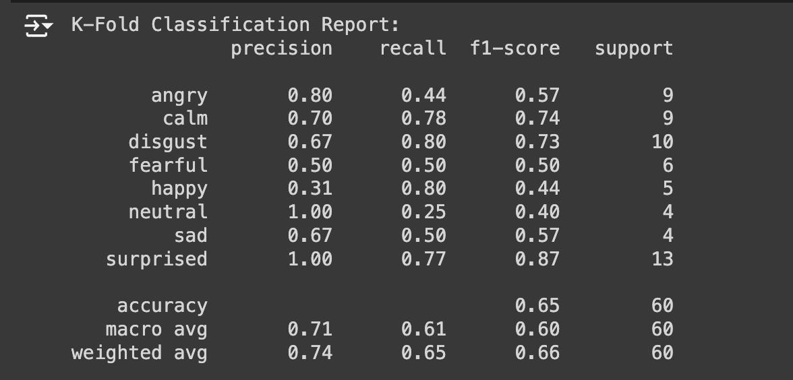

# Emotion detection basred on their voice

# About the dataset: 
This RAVDESS dataset contains 1440 files: 60 trials per actor x 24 actors = 1440. The RAVDESS contains 
24 professional actors (12 female, 12 male), vocalizing two lexically-matched statements in a neutral 
North American accent. Speech emo ons includes calm, happy, sad, angry, fearful, surprise, and disgust 
expressions. Each expression is produced at two levels of emo onal intensity (normal, strong), with an 
addi onal neutral expression. 
Each of the 1440 files has a unique filename. The filename consists of a 7-part numerical iden fier (e.g., 
03-01-06-01-02-01-12.wav). These iden fiers define the smulus characteris cs: 
Filename iden fiers: 
 Modality (01 = full-AV, 02 = video-only, 03 = audio-only). 
 Vocal channel (01 = speech, 02 = song). 
 Emo on (01 = neutral, 02 = calm, 03 = happy, 04 = sad, 05 = angry, 06 = fearful, 07 = disgust, 08 
= surprised). 
 Emo onal intensity (01 = normal, 02 = strong). NOTE: There is no strong intensity for the 
'neutral' emo on. 
 Statement (01 = "Kids are talking by the door", 02 = "Dogs are si ng by the door"). 
 Repe on (01 = 1st repe on, 02 = 2nd repe on). 
 Actor (01 to 24. Odd numbered actors are male, even numbered actors are female). 
Filename example: 03-01-06-01-02-01-12.wav 
1. Audio-only (03) 
2. Speech (01) 
3. Fearful (06) 
4. Normal intensity (01) 
5. Statement "dogs" (02) 
6. 1st Repe on (01) 
7. 12th Actor (12) 
Female, as the actor ID number is even. 

# Plots for MFCC , Chroma , Mel-Scaled spectrogram , spectral contrast , Tonnetz 

#  KNN Classification Report:-

# MLP classifiers:-

# K-Fold Classification Report:-

# SVM Classification Report:-

